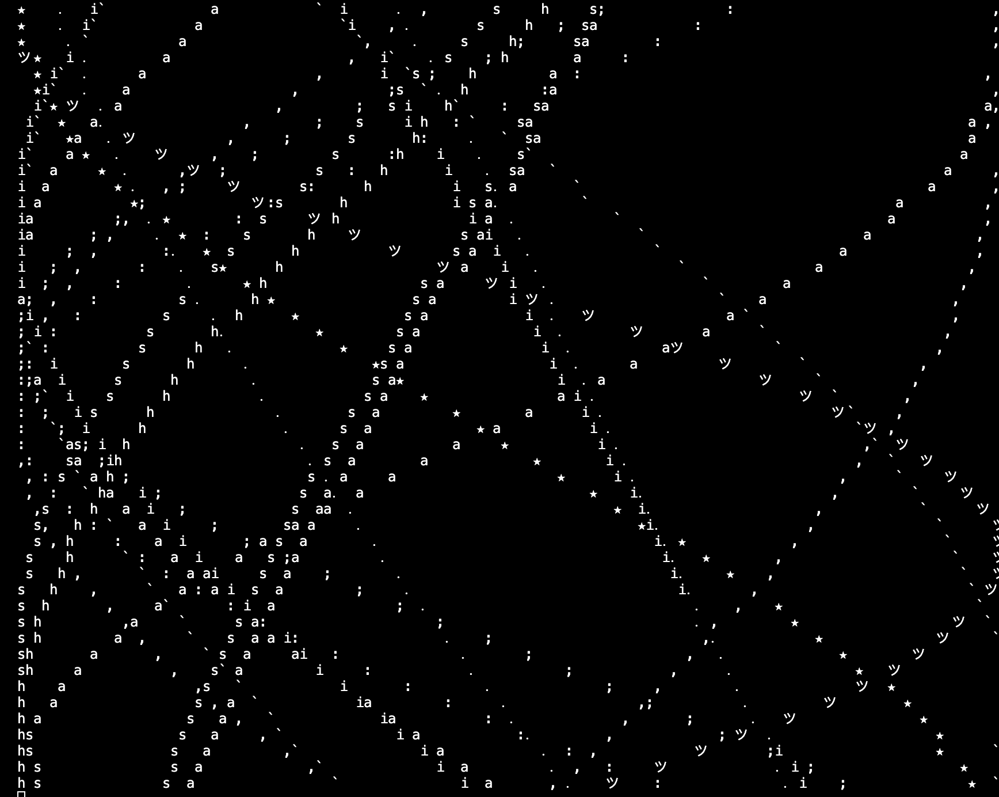

# cc-assignment3
###for my assignment 3 i used code by Al Sweigart from the scroll art museum. i edited a few parts of the code: 
- the width of the art
- the range for i
- i added delay changes so that the scroll art speeds up and slows down
- i changed the characters so that it uses characters from my name, and some other cute ones
  
[link to original code](https://scrollart.org/orbital-travels/)

[link to my edited code](https://github.com/lethinix/cc-assignment3/blob/main/cc-assignment3.py)

  <video controls width="600">
    <source src="./scroll-art.mov" type="video/mp4">
    Your browser does not support the video tag.
</video>
 
